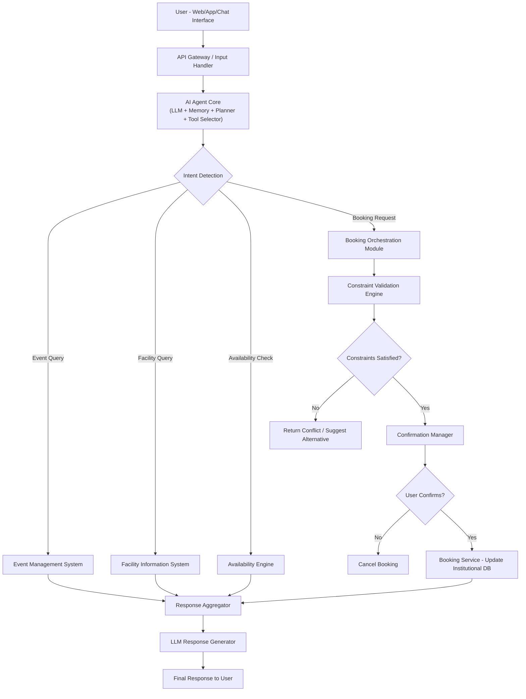

# AI Agent Architecture for Campus Event, Facility & Booking Management

## Problem Statement

Design an AI Agent for a college campus that:

- Provides information about upcoming events
- Supplies details about campus facilities (labs, rooms, auditoriums)
- Checks room and lab availability
- Handles registration and booking-related queries
- Identifies user intent automatically
- Validates constraints before booking
- Confirms user intent before executing booking actions

The system must demonstrate multi-step reasoning, internal tool selection, constraint validation, and response generation.

## System Overview

This architecture implements an Agentic AI system that intelligently routes user requests to appropriate internal campus systems. The AI Agent performs intent detection, decision-making, constraint validation, and confirmation handling before producing a final response.

The architecture is modular, scalable, and production-ready, designed around tool orchestration principles.

## Architecture Diagram

## System Flow Explanation

1. The user submits a query via web or chat interface.
2. The API Gateway forwards the request to the AI Agent Core.
3. The Agent Core uses an LLM with memory and planning capability to detect user intent.
4. Based on intent classification, the agent selects the appropriate internal system:
   - Event Management System
   - Facility Information System
   - Availability Engine
   - Booking Module
5. If booking is requested, the agent performs constraint validation (capacity, time conflicts, role permissions).
6. The system requests explicit confirmation from the user before executing booking.
7. Once confirmed, the Booking Service updates the institutional database.
8. The Response Aggregator combines all outputs.
9. The LLM formats a clear, structured final response.

## Core Internal Components

### 1. AI Agent Core
- Large Language Model (LLM)
- Conversation Memory
- Planning Module
- Tool Selector

Responsible for reasoning and orchestration.

### 2. Intent Detection Module
Classifies requests into:
- Event Information
- Facility Information
- Availability Check
- Booking Request

Can be implemented via zero-shot classification or fine-tuned transformer models.

### 3. Event Management System
Stores:
- Upcoming events
- Schedules
- Event locations

### 4. Facility Information System
Stores:
- Lab details
- Room capacity
- Auditorium information
- Operating hours

### 5. Availability Engine
Checks:
- Date and time conflicts
- Maintenance schedules
- Concurrent bookings

### 6. Constraint Validation Engine
Validates:
- Capacity limits
- Role-based access
- Operational restrictions
- Booking overlap

### 7. Confirmation Manager
Ensures explicit user approval before booking execution.

### 8. Booking Service
- Writes booking record into Institutional Database
- Maintains audit logs

### 9. Response Aggregator
Combines outputs from multiple systems before response generation.

## Libraries & Frameworks

### LLM & Agent Orchestration
- **LangChain / LlamaIndex**: Chosen for their robust abstraction layers that simplify tool orchestration, memory management, and agentic workflows. They allow for easy integration of multiple tools and LLMs.
- **OpenAI API / LLM API**: Selected as the primary reasoning engine due to state-of-the-art performance in intent detection and complex instruction following.

### Backend
- **FastAPI**: Selected for its high performance (asynchronous capabilities), native support for concurrency (essential for LLM latency), and automatic OpenAPI documentation. It is ideal for building scalable microservices.

### Database
- **PostgreSQL**: Chosen for robust relation data storage. It is essential for maintaining structured records of events, facilities, and bookings with ACID compliance.
- **Redis**: Used for low-latency session memory and caching frequently accessed data (like facility lists) to improve agent response times.

### Vector Database (Optional Enhancement)
- **FAISS / Pinecone**: Recommended for semantic retrieval. Allows the agent to find facilities based on vague descriptions (e.g., "quiet place with a projector") rather than exact keyword matches.

### Intent Detection
- **HuggingFace Transformers**: Used for local, low-latency intent classification pipelines if a dedicated smaller model is preferred over calling a large LLM for every routing decision.

## Security & Governance

- Authentication & Authorization layer
- Role-Based Access Control (RBAC)
- Audit logging for bookings
- Data encryption in transit

## Scalability & Future Enhancements

- Microservices deployment
- Load balancing
- Monitoring & observability (Prometheus, Grafana)
- Multi-campus support
- Feedback loop for agent improvement

## Why This Architecture is Effective

- Multi-step reasoning
- Dynamic tool selection
- Explicit confirmation before action
- Constraint validation logic
- Modular and scalable design
- Production-ready system layout

This design demonstrates intelligent decision-making using an Agentic AI orchestration approach rather than a simple chatbot architecture.

## Author

Siddharth Nama  
B.Tech CSE - IIIT Bhagalpur  
AI/ML Engineering Campus 2026
